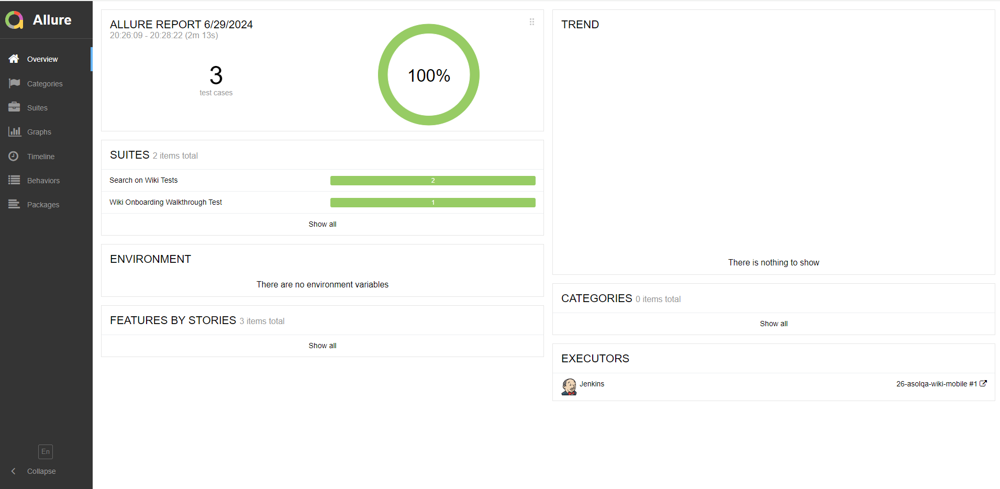

# Mobile test automation project for [Wikipedia App ](https://github.com/wikimedia/apps-android-wikipedia/)

---


</a>

---


## Content:

- <a href="#tools">Tools and technologies</a>
- <a href="#facts">Project features</a>
- <a href="#scenarios">Test scenarios</a>
- <a href="#cli">Launch from the CLI</a>
- <a href="#jenkins">CI/CD with Jenkins</a>
- <a href="#allure">Allure reporting</a>
- <a href="#allure-testops">Integration with Allure TestOps</a>
- <a href="#jira">Integration with JIRA</a>
- <a href="#telegram">Bot notifications in Telegram</a>


<a id="tools"></a>
## Tools and technologies
<p align="center">
<a href="https://www.jetbrains.com/idea/"></a>  
<a href="https://www.java.com/"></a>   
<a href="https://appium.io/docs/en/latest/"></a>  
<a href="https://developer.android.com/"></a>  
<a href="https://www.browserstack.com/home"></a>  
<a href="https://github.com/"></a>  
<a href="https://junit.org/junit5/"></a>  
<a href="https://gradle.org/"></a>
<a href="https://github.com/allure-framework/allure2"></a>
<a href="https://qameta.io/"></a>   
<a href="https://www.jenkins.io/"></a>  
<a href="https://www.atlassian.com/ru/software/jira/"></a>
</p>

<a id="facts"></a>
## Project features
* `Page object` pattern 
* Config with `Owner` library
* Test cases as a documentation with `Allure TestOps`
* Launch all or separate tests from TMS directly
* `JIRA` integration
* Telegram notifications

<a id="scenarios"></a>
## Test Scenarios
* [x] Wiki onboarding walkthrough test
* [x] Search for data test
* [x] Search and open an article test


<a id="cli"></a>
##  Launch from the CLI

Local launch:

```bash  
./gradlew clean test -Ddriver.class.name=driver.LocalDriver
```
>Be sure you have installed all needed  pre-requisites/dependencies as `Android Studio`, `node.js`, `Appuim` locally according to [instruction](https://autotest.how/appium-setup-for-local-android-tutorial-md)

Remote launch:
```bash  
./gradlew clean test -Ddriver.class.name=driver.BrowserstackDriver
```
>Browserstack requires unique user credentials. Also download the latest version of app 
>and upload it to the browserstack before test execution. Get the unique app id and set in the configuration file.

All configurations are described in the `local_runner.properties`, `browser_stack_runner.properties`, `runner.properties` 
and `credentials.properties` files. If needed configurations could be changed in those files.

<a id="jenkins"></a>
## </a><a name="CI/CD with Jenkins"></a>CI/CD with [Jenkins](https://jenkins.autotests.cloud/job/26-asolqa-wiki-mobile/)</a>
 

### Jenkins job

- `COMMENT` parameter (by default @asolqa is tagged)

After the build is done the test results are available in `Allure`, `Allure TestOps` and `JIRA`

<a id="allure"></a>
## </a> <a name="Allure"></a>Allure [reporting](https://jenkins.autotests.cloud/job/26-asolqa-wiki-mobile/allure/)</a>
 

`Allure` report includes logged test steps, attached page source and video for remote execution:


<a id="allure-testops"></a>
## </a> Integration with <a target="_blank" href="https://allure.autotests.cloud/project/4314/dashboards">Allure TestOps</a>

`Allure TestOps` processes tests as a documentation and allows to launch them directly from TMS. 

Here all test cases execution results are available. 

Dashboard contains test runs statistics:


All test cases:


To execute tests from TestOps move to <a target="_blank" href="https://allure.autotests.cloud/project/4314/jobs">Jobs</a> and submit the launch:


Launches:


<a id="jira"></a>
## </a> Integration with <a target="_blank" href="https://jira.autotests.cloud/browse/HOMEWORK-1287">Jira</a>

`Jira` has information about all related test cases, their statuses and launches results from `Allure TestOps`:


<a id="telegram"></a>
## </a> Bot notifications in Telegram
After every build Telegram bot sends notification with `Allure` report:
 

<a id="video"></a>
## </a> Examples of test execution
 
 


